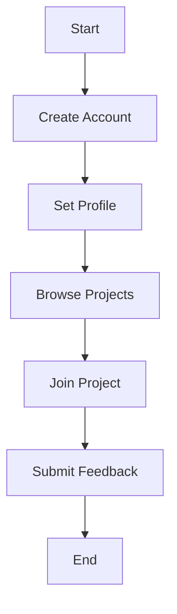

# Product Requirements Document (PRD)

## Product Overview

### Vision
The vision for FlowvVibe is to develop an innovative platform that enhances collaboration among indie makers, startups, and community managers, fostering creativity and productivity through seamless integration of features tailored to their needs.

### Objectives
1. To create a user-friendly environment that encourages collaboration among users.
2. To provide tools that cater to the unique needs of indie makers, startup CTOs, and community managers.
3. To achieve high user satisfaction and engagement metrics within the first year of launch.

### Success Metrics
- User Engagement: Achieve a monthly active user count of 10,000 within 6 months.
- User Satisfaction: Maintain a user satisfaction score of 85% or higher.
- Retention Rate: Achieve a retention rate of 60% after 3 months of onboarding.

## User Personas and Journeys

### User Persona: Kavita (Indie Maker)
- **Age**: 28
- **Location**: Panipat, India
- **Goals**: To find a platform that supports her creative projects and connects her with likeminded individuals.
- **Challenges**: Limited access to resources and collaboration tools.

### User Journey
1. Discover the platform through social media.
2. Create an account and set up a profile.
3. Browse community projects.
4. Join a project and contribute.
5. Share feedback and receive recognition.

### User Persona: Harish (Startup CTO)
- **Age**: 35
- **Location**: Bangalore, India
- **Goals**: To locate talented developers and create a network of startup resources.
- **Challenges**: Finding committed team members and effective tools for collaboration.

### User Journey
1. Register on the platform and create a startup profile.
2. Post project ideas and seek collaborators.
3. Engage with indie makers.
4. Provide mentorship and feedback.
5. Track project progress.

### User Persona: Priya (Community Manager)
- **Age**: 30
- **Location**: Delhi, India
- **Goals**: To foster engaged communities and support creators.
- **Challenges**: Maintaining user interaction and managing resources effectively.

### User Journey
1. Sign up for the platform and create a community group.
2. Facilitate discussions and events.
3. Monitor engagement through analytics.
4. Recognize top contributors.
5. Integrate feedback into future community projects.

## Feature Requirements
| User Story                                   | MoSCoW Priority | Acceptance Criteria                             | Dependencies                  |
|----------------------------------------------|-----------------|------------------------------------------------|--------------------------------|
| As an indie maker, I want to create a project profile. | Must Have       | User can create, edit, and delete a profile. | User account must be created.  |
| As a CTO, I need to post project ideas to seek collaborators. | Must Have       | User can post ideas and receive applications.   | User account must be created.  |
| As a community manager, I want to analyze user engagement metrics. | Should Have     | Analytics dashboard shows user activity.       | Analytics tools integration.   |

## User Flows

### User Flow: Kavita's Journey

### Error Handling
- **User Account Creation Error**: Display error message and allow retries.

## Non-Functional Requirements

### Performance
- Application should maintain 60 FPS for animations and UI transitions.
- Page loads should be under 2 seconds.

### Security
- Implement OAuth for secure user authentication.
- Enforce Content Security Policy (CSP) headers.

### Accessibility
- Comply with WCAG AA standards for accessibility.

### Compatibility
- Ensure compatibility with latest versions of major browsers.

## Technical Specifications

### Frontend: React/TypeScript
- Utilize React for building user interfaces.
- TypeScript for type safety and improved development experience.

### Backend: Express.js/PostgreSQL
- Use Express.js for server-side application logic.
- PostgreSQL for robust data management.

### Infrastructure: Docker
- Containerize applications using Docker.

## Analytics and Monitoring
- Use Google Analytics for user behavior tracking.
- Set up monitoring with tools like Sentry for error tracking.

## Release Planning
- **MVP v1.0**: Launch date - Q3 2026.
- **Roadmap for v1.1**: Community features (Q1 2027).
- **Roadmap for v2.0**: Enhanced collaboration tools (Q3 2027).

## Risks, Assumptions and Open Questions
- Risk of low user adoption - mitigation through marketing.
- Assumption: Target audience will find value in the platform.
- Open Questions: What features are most desired by users?

## Appendix
### Competitor Analysis
- Competitor A: Feature comparison.
- Competitor B: Strengths and weaknesses.

### Glossary
- **MVP**: Minimum Viable Product.
- **CSP**: Content Security Policy.
- **WCAG**: Web Content Accessibility Guidelines.
